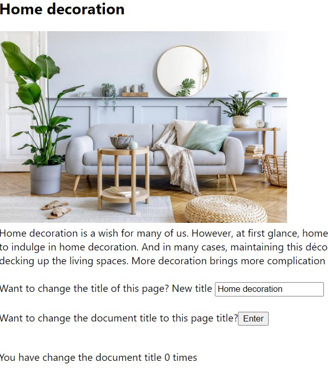
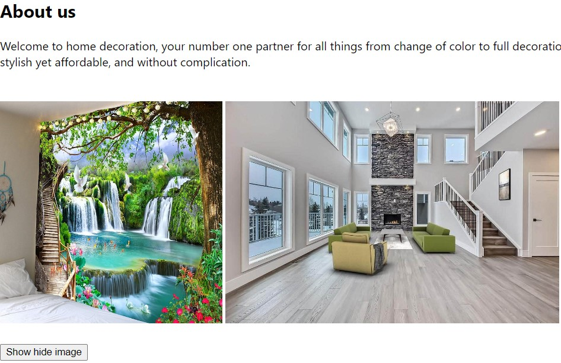
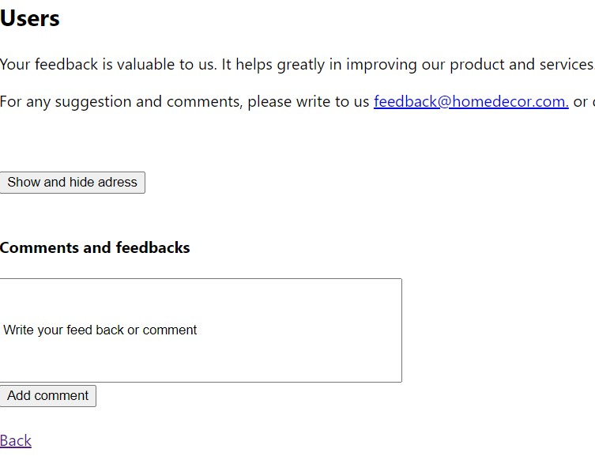

# React inlamning report

## Objective of task
The goal of the task to creat an **app** that should have at least 3 views and navigation. The application should be created using react-router-dom. The application must make use of the following things:
<ul>
  <li>form</li>
  <li>useState hook to handle form data</li>
</ul> 

## Planning

I started with creating a react-type-script project and cleaned the project with unneccessary files. I have created three pages Home, About and Users using SPA (single page application). I have used useEffect hook and useState hook on all pages. I have used these hooks to change the title and add feedback on the user's page. 

I have designed a home-decor webside with minimal content. The main focus is to use react functions and hooks. The webside  advertises products and also receive the feedback on user.

## About the website

The home page contains a short description about the home decoration and provide option to change the title of the page and document. It also counts how many times a user has changed the document's title. 

The about page describes the products and has some images of the products. The react hook is used to show and hide the image on this page.

The user page is designed for the customer to contact us. The page provides an option to directly write an email or write a feedback directly on the page. The feedback is updated on the page using useEffect and useState hooks. 

*Sania Athar*